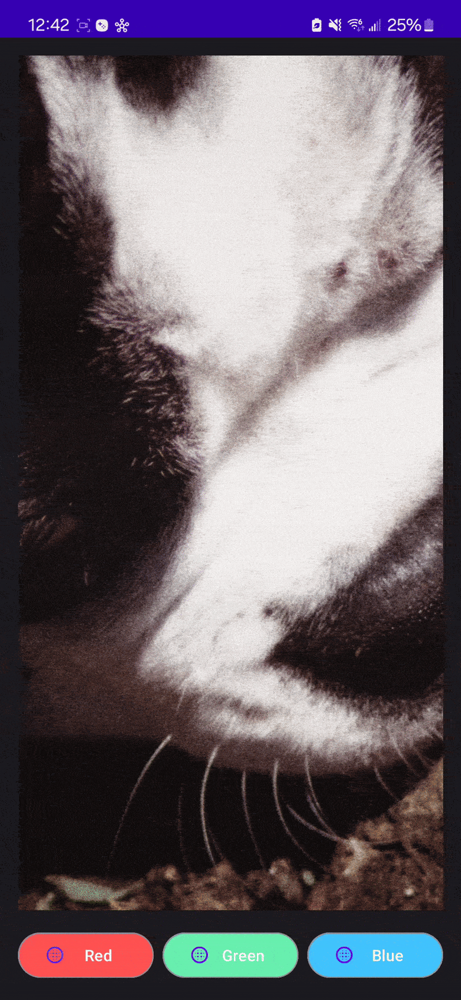

HI.
This is  a simple app that includes 3 uniquely colored buttons with a separate icon for each.
When you click on the buttons the picture changes. Each button displays a different picture.
There's a small fade transition when changing pictures or clicking on each button.
The top bar is a plain purple color using Material Design.
I have a working apk ready, and here's the app running on my phone.

## Demo
</img>

